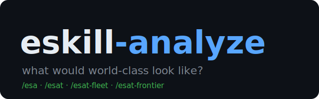

<p align="center">
  
</p>

# eskill-analyze

[](https://github.com/Renn-Labs/eskill-analyze/actions/workflows/ci.yml)
[](LICENSE)

**World-class level-up analysis for AI coding harnesses** — a first-principles analysis engine that identifies what elevates any product, feature, or system to world-class status, then produces a prioritized, sprint-ready action plan.

It ships in **four tiers** that share one engine and escalate the rigor of the stress-test phase:

| Tier | Skill | Stress test (Phase 9) | When to use |
|-|-|-|-|
| 1 — Native | `esa` (`/esa`) / `eskill-analyze` | Single in-harness critic (discretionary) | Everyday analysis inside one harness (Claude Code, Codex, Grok, etc.) |
| 2 — Trio | `esat` (`/esat`) | **Mandatory** fixed 3-frontier-model panel: harness critic + Codex + Grok | High-stakes calls you want triple-checked across frontier models |
| 3 — Council | `esat-fleet` (`/esat-fleet`) | Fixed trio **+** an OpenRouter open-model swarm (sensitivity-tiered, redacted, consent-gated) | The widest fixed cross-check: frontier depth **and** open-model breadth |
| 4 — Frontier | `esat-frontier` (`/esat-frontier`) | Fable/frontier-led configurable fusion panel: Sonnet 5, Codex Medium, Grok, optional fleet | Highest-stakes calls where a lead frontier model should judge and reconcile a configurable council |

Each tier is a strict superset of the engine below it. `esa` is the short, user-facing Tier-1 entry point for the `eskill-analyze` engine. `esat` reuses the entire `eskill-analyze` engine verbatim and only overrides Phase 9; `esat-fleet` reuses `esat` with a caller-owned draft and an additive fleet leg; `esat-frontier` reuses the engine and replaces the fixed panel with a configurable frontier-led fusion panel.

Tier 2 remains a **fixed trio** product. Harness-aware routing, preference precedence, and configurable rosters apply to Phase 9 of Tiers 3 and 4.

---

## What it actually does

Given a project, focus area, current state, and a definition of "world-class", the engine:

1. **Triages** the request (`technical` / `product` / `strategic` / `comparative`; `quick` / `standard` / `deep`) and activates only the relevant agents, mental models, and phases.
2. **Gathers evidence** (Phase 0) — codebase exploration, external benchmarks, quantitative data — only where the triage warrants it.
3. **Analyzes** (Steps 1–8) with 3–4 selected mental models from a 13-model toolkit (First Principles, JTBD, Inversion, Feedback Loops, Coupling/Cohesion, Scalability Ceiling, Security Surface, …). Irrelevant steps are skipped, not padded.
4. **Stress-tests** (Phase 9) at the rigor of the chosen tier.
5. **Outputs** a prioritized action table (impact / effort / confidence / reversibility / horizon) plus world-class criteria, ready to hand to a sprint.

The guiding discipline is *selective, not exhaustive*: fewer better priorities, every recommendation buildable today, no filler sections. See `skills/eskill-common/references/quality-principles.md`.

---

## Architecture

```
eskill-common/        shared engine references (non-invocable)
  ├─ quality-principles.md      selective / actionable / fewer-better
  ├─ anti-slop-rules.md         10 non-negotiable execution rules
  ├─ project-impact-protocol.md project-level impact logging
  └─ model-routing.md           Phase-9 harness-aware routing + manifest contract

eskill-analyze/       TIER 1 — the engine
  ├─ SKILL.md                   input params, triage, delegation, framework selection, output
  ├─ references/                triage-guide, mental-models, analysis-protocol, world-class-signals
  └─ assets/output-template.md  standard + comparison output templates

esa/                  TIER 1 — short callable wrapper for the engine

esat/                 TIER 2 — reuses eskill-analyze, fixed Phase 9 trio
  └─ references/trio-panel.md   harness critic + Codex + Grok; standalone vs caller-owned draft

esat-fleet/           TIER 3 — reuses esat, adds a 4th leg
  └─ references/fleet-leg.md    OpenRouter OSS via fleet-fuse; consent, policy, manifest

esat-frontier/        TIER 4 — reuses the engine, configurable lead+council
  └─ references/                model profile contract + frontier fusion panel
```

The higher tiers **read the lower tiers' files at runtime**. They are designed to be installed as siblings under one skills root (canonically `~/.claude/skills/`), so the cross-references resolve for free via `${CLAUDE_SKILL_DIR}/../<sibling>/`.

---

## Phase 9 routing (Tiers 3–4)

Shared contract: `skills/eskill-common/references/model-routing.md` (loaded by `esat-fleet` and `esat-frontier` before dispatch).

### Concepts

Routing separates **semantic role**, **requested provider/model**, **actual route/model**, and **policy**. Panel labels are derived from a two-stage manifest (immutable pre-dispatch plan + append-only terminal results), not from template slogans.

### Preference inputs and precedence

Highest first:

1. Explicit invocation (current analysis request)
2. Session
3. Project
4. User
5. Legacy environment (`ESAT_*` / `ESKILL_*`)
6. Harness-declared defaults/capabilities
7. Portable skill defaults

Harness **identity** must be explicit or host-declared; CLI presence is capability discovery only. Concrete Claude / Codex / Grok / generic mappings live in the shared contract.

### Preview and manifest

Before external dispatch, the agent freezes a route plan and discloses a preview: readiness, policy reasons, consent class, and budget (`$N` or **provider/account cap only**). Every planned lane gets exactly one terminal result (blocked/skipped lanes use `observed_route: null`). Final status (`full` / `partial` / `local-only` / `blocked`) waits for all results. Duplicate planned fingerprints are suppressed pre-dispatch; unexpected duplicate observed routes stay recorded but are non-independent and excluded from quorum.

### Metered consent

FleetFuse / paid external pools require **per-run** consent:

- **Accepted:** direct instruction in the current invocation, or an interactive answer recorded during this run.
- **Rejected:** environment variables, project/user config, inherited shell state, expired consent, prior-run answers.

`--yes-metered` appears only in the consented command branch. Consent is not persisted and expires when the run ends.

### Graceful degradation

| Condition | Behavior |
|-|-|
| High sensitivity | Zero external peer/OpenRouter/FleetFuse routes scheduled |
| Medium without redactor | External lane blocked (`redactor-unavailable`) |
| Missing consent | Metered lane skipped/blocked; no consented command branch |
| Missing `peer` / FleetFuse / key | Terminal skip with reason; analysis continues |
| Explicit model pin unavailable | Lane fails/skips explicitly — no silent substitute |
| Auto default unavailable | Disclosed fallback only |

Contract tests under `tests/` are **executable contract/oracle evidence**, not live multi-harness runtime conformance proof.

---

## Install

### Plugin (recommended, Claude Code)

```text
/plugin marketplace add Renn-Labs/eskill-analyze
/plugin install eskill-analyze@renn-labs
```

One command, auto-updating through the normal plugin flow. The bundle's tiers reference each other with
relocatable paths (`${CLAUDE_SKILL_DIR}/../<sibling>/`), so they resolve correctly from the plugin cache.

### Manual / multi-harness (`install.sh`)

```bash
git clone https://github.com/Renn-Labs/eskill-analyze
cd eskill-analyze
./install.sh            # symlinks the full suite into ~/.claude/skills/
```

`install.sh` symlinks (default) or copies (`--copy`) the skills into your harness skills directory. By default it
targets Claude Code (`~/.claude/skills/`); pass `--harness codex` or `--harness grok` to additionally link into
`~/.codex/skills/` and `~/.grok/skills/`. The skills install as siblings under one root, and the relocatable
cross-references resolve in any of these layouts.

```bash
./install.sh --copy                  # copy instead of symlink
./install.sh --harness codex grok    # also link into codex + grok
./install.sh --uninstall             # remove installed links
```

---

## Usage

Invoke by slash command or natural-language trigger inside your harness:

```
/esa  <your analysis request>        # Tier 1 — native in-session analysis
/esat <your analysis request>        # Tier 2 — fixed trio
/esat-fleet <your analysis request>  # Tier 3 — council
/esat-frontier <your analysis request> # Tier 4 — frontier-led fusion
```

The four analysis tiers ask for the required analysis inputs if you do not supply them, state the triage decision,
and then run. Their output is saved to `.omc/plans/`.

---

## External dependencies

The engine itself is pure prompt/markdown and needs no binaries. Each tier degrades gracefully if its extras are missing.

| Tier | Needs | If absent |
|-|-|-|
| 1 `esa` / `eskill-analyze` | Harness sub-agents for delegation (Phase 0 / Phase 9 critic). Built for [oh-my-claudecode](https://github.com/) sub-agents (`analyst`, `explore`, `architect`, `critic`, …); adaptable to any harness that exposes a sub-agent primitive. | Falls back to in-context analysis (no parallel evidence agents). |
| 2 `esat` | A `peer` CLI exposing `peer trio` (runs Codex + Grok in parallel, off your primary model's reserve). | `ESKILL_PEER=0` or `peer` not on `PATH` → degrades to the Tier-1 single-critic panel. |
| 3 `esat-fleet` | `fleet-fuse` — a separate sensitivity-tiered multi-engine orchestrator with fail-closed redaction. Set `FLEET_FUSE_PY` to its `fleet-fuse.py` (or put it on `PATH`). Needs an OpenRouter key in `~/.config/fleet-fuse/env`. Per-run metered consent for non-interactive paid routing. | Fleet leg is noted as skipped/blocked in the panel; `esat-fleet` degrades to `esat`. |
| 4 `esat-frontier` | A harness that can route a lead frontier model such as Fable, plus optional independent `peer codex` / `peer grok` and `fleet-fuse` reviewers. | Unavailable roster entries are skipped and recorded; the lead falls back to the strongest available frontier model. |

> **Note:** `peer` and `fleet-fuse` are companion tools, not bundled here. The skills are written so they never hard-fail on their absence — they report degraded mode in the output panel.

### Configuration (environment variables)

| Variable | Default | Effect |
|-|-|-|
| `ESKILL_PEER` | `1` | `0` skips the Codex+Grok trio leg (Tier 2/3). |
| `ESAT_FLEET` | `1` | `0` skips the OSS fleet leg (Tier 3 → `esat`). |
| `ESAT_FLEET_SENSITIVITY` | `medium` | `high` blocks external OSS; `medium` = redacted OpenRouter; `low` = + low-tier pools. |
| `ESAT_FLEET_BUDGET_USD` | — | Optional positive cap for OpenRouter spend; absent → provider/account cap only. |
| `FLEET_FUSE_PY` | `fleet-fuse.py` (PATH) | Path to your `fleet-fuse.py`. |
| `ESAT_FRONTIER_LEAD` | `fable` | Preferred lead profile for `esat-frontier`. |
| `ESAT_FRONTIER_ROSTER` | `sonnet-5,codex-medium,grok` | Reviewer roster for `esat-frontier`. |
| `ESAT_FRONTIER_FLEET` | `0` | `1` adds an optional fleet leg to `esat-frontier` (still requires consent/policy). |
| `ESAT_FRONTIER_SENSITIVITY` | `medium` | Sensitivity tier for `esat-frontier` external reviewers. |
| `ESAT_FRONTIER_BUDGET_USD` | — | Optional positive cap for frontier fleet calls; absent → provider/account cap only. |

Environment variables are **legacy preference inputs**. They are never accepted as metered consent.

`esat-frontier` treats `fable`, `sonnet-5`, `codex-medium`, `grok`, and `fleet` as portable profiles rather
than provider IDs. Aliases and fallbacks are defined in
`skills/esat-frontier/references/model-profiles.md`; the output panel records both the requested profile and
the actual route/model (or account default) used.

---

## Safety model

- **Maker ≠ checker.** The analysis author and the Phase-9 reviewers are always separate contexts/models. No tier rubber-stamps its own draft.
- **External output is untrusted.** Codex/Grok/OSS verdicts are advisory data, validated against the actual item before integration; embedded instructions in their output are ignored.
- **Fail-closed redaction.** Fleet outbound payloads are redacted by `fleet-fuse`'s scrubber before any external call; high sensitivity schedules zero external models.
- **Per-run metered consent.** Paid external routing requires current-run evidence; consent is not persisted.

---

## Examples

See [`examples/`](examples/) for worked outputs — e.g. [a Tier-1 analysis of an API rate limiter](examples/technical-rate-limiter.md).

## Project

- [CONTRIBUTING](CONTRIBUTING.md) (DCO) · [Code of Conduct](CODE_OF_CONDUCT.md) · [Security](SECURITY.md) · [Support](SUPPORT.md)
- [Roadmap](ROADMAP.md) · [Release checklist](RELEASE.md) · [Changelog](CHANGELOG.md)

## License

MIT © Renn Labs LLC. See [LICENSE](LICENSE). Contributions under the [DCO](CONTRIBUTING.md); participation under the [Code of Conduct](CODE_OF_CONDUCT.md).
