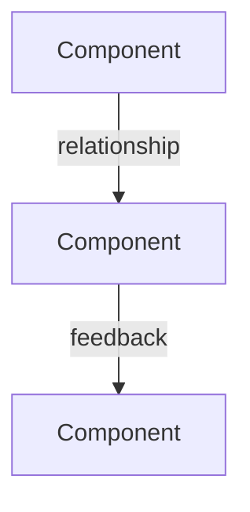

# Analysis Output Template

## Analysis: [Focus Area]

### Triage
**Type**: {technical|product|strategic|comparative} / **Scale**: {quick|standard|deep}
**Agents**: {list activated agents}
**Models**: {list selected mental models}

### Evidence Summary
_Only include when Phase 0 ran. Summarize key findings from explore/document-specialist/scientist agents._

[Codebase signals | External benchmarks | Quantitative data — as applicable]

### First-Principles View
[3-5 sentences. Core truth, stripped to essentials.]

### System Map
[When relationships are simple, use prose. When 3+ components interact, use Mermaid:]

### 7-Step Path
| Step | Now | 30 Days | 90 Days | 1 Year |
|-|-|-|-|-|
| Experience | | | | |
| Value | | | | |
| Retention | | | | |
| Habit | | | | |
| Advocacy | | | | |
| Lock-in | | | | |
| Ecosystem | | | | |

### Failure Modes (Pre-Mortem)
| Risk | Likelihood | Impact | Prevention |
|-|-|-|-|
| | | | |

### Competitive Response
[What competitors would do + our moat]

### AAARRR Breakdown
- Acquisition:
- Activation:
- Retention:
- Referral:
- Revenue:

### Project-Level Impact
| Action | Project Impact | Business Impact | Dependencies | Priority Alignment |
|-|-|-|-|-|
| | | | | |

### Prioritized Actions
| # | Action | Impact | Effort | Confidence | Reversible | Horizon | AAARRR | Why |
|-|-|-|-|-|-|-|-|-|
| 1 | | H/M/L | H/M/L | H/M/L | Y/N | Quick/Foundation/Long | | |

_Confidence column populated when stress test ran. Otherwise omit._

### Stress Test Notes
_Only include when Phase 9 ran and surfaced material changes._

[Blind spots identified | Assumptions challenged | Adjustments made]

### World-Class Criteria
[3-5 specific, measurable signals that prove we're there]

---

## Comparison Mode Template

_Use this variant when triage classifies as `comparative`._

## Comparison: [Option A] vs [Option B]

### Triage
**Type**: comparative + {technical|product|strategic} / **Scale**: {quick|standard|deep}

### Evidence Summary
_Per-option evidence if Phase 0 ran._

### Side-by-Side Analysis
| Dimension | Option A | Option B |
|-|-|-|
| First-Principles Fit | | |
| Complexity | | |
| Scalability | | |
| Reversibility | | |
| Time to Value | | |
| Risk Profile | | |
| Team Fit | | |

### System Maps
_One diagram per option if warranted, or a combined diagram showing interaction._

### Failure Modes
| Risk | Option A | Option B |
|-|-|-|
| | likelihood/impact | likelihood/impact |

### Recommendation
**Winner**: [Option] for [context/constraints].
**Tradeoff**: [What you give up by choosing the winner.]
**When to reconsider**: [Conditions that would flip the recommendation.]

### Prioritized Actions (for recommended option)
| # | Action | Impact | Effort | Confidence | Reversible | Horizon | Why |
|-|-|-|-|-|-|-|-|
| 1 | | H/M/L | H/M/L | H/M/L | Y/N | Quick/Foundation/Long | |
