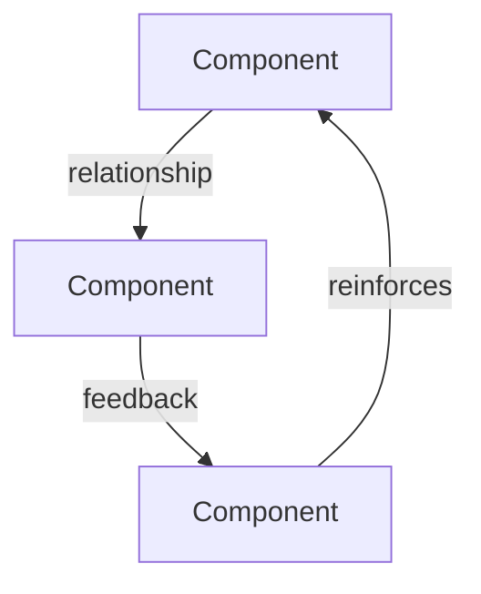

# Analysis Protocol

Triage-driven analysis framework. Run Phase 0 before analysis, apply only relevant steps, then stress-test if scale warrants it.

See `${CLAUDE_SKILL_DIR}/references/triage-guide.md` for activation logic.
See `${CLAUDE_SKILL_DIR}/references/mental-models.md` for framework selection guidance.

## PHASE 0: Evidence Gathering (Discretionary)

Run before analysis. Triage determines which agents activate. All run in parallel.

```
# Always (if codebase exists)
Task(subagent_type="oh-my-claudecode:explore", model="sonnet",
     prompt="Gather evidence for analysis of: {focus_area}.
     - Git log: recent commits, active contributors, change velocity
     - Code metrics: file count, largest files, dependency graph hotspots
     - Test coverage: what's tested, what's not
     - Architecture: key boundaries, entry points, data flow
     Final response under 2000 characters. List findings, not process.")

# When triage activates document-specialist (product, strategic)
Task(subagent_type="oh-my-claudecode:document-specialist", model="sonnet",
     prompt="Research what world-class looks like for: {domain} / {focus_area}.
     Find: industry benchmarks, best-in-class examples, emerging patterns, common pitfalls.
     Final response under 2000 characters. List findings with sources.")

# When triage activates scientist (data/metrics available)
Task(subagent_type="oh-my-claudecode:scientist", model="sonnet",
     prompt="Analyze available quantitative data for: {focus_area}.
     Look for: usage patterns, performance metrics, error rates, trends.
     Final response under 2000 characters. List key numbers and what they mean.")
```

Synthesize Phase 0 outputs into an Evidence Summary before proceeding to Step 1.

---

## STEP 1: First-Principles Decomposition

Answer these 5 questions:

1. **What is this really?** Remove implementation. What's the core problem solved?
2. **Who benefits and how?** Map all stakeholders. What do they actually value?
3. **What's the smallest engine that makes this work?**
4. **What would make this indispensable?** Not good — indispensable.
5. **What's the gap?** Between current experience and ideal.

## STEP 2: Mental Model Application

Pick 3-4 from `${CLAUDE_SKILL_DIR}/references/mental-models.md` and apply only those. Do not force all 8.

## STEP 3: Jobs-to-be-Done (product, product+strategic only — skip for pure technical)

For your core user:
- What are they trying to accomplish?
- What are they afraid of?
- What would make their life easier?
- What would they pay extra for?

## STEP 4: System Mapping

Map the relationships:
- **Input to Output**: What enters, what exits?
- **Feedback Loops**: Where's the compounding? Where's the decay?
- **Leverage Points**: Small changes, big impact — where are they?
- **Unintended Consequences**: What could go wrong?
- **Emergent Properties**: What could emerge that we haven't planned?

When 3+ components interact, generate a Mermaid diagram instead of prose:



Use `graph TD` for hierarchies, `graph LR` for flows, `flowchart` for complex branching. Keep diagrams focused — max 10-12 nodes.

## STEP 5: 7-Step Execution Path (product, strategic — skip for pure technical)

| Step | Timeframe | What Happens | Key Question |
|-|-|-|-|
| 1 | Day 1 | Immediate experience | Does it work? |
| 2 | First session | First impression | Is this valuable? |
| 3 | First week | Repeat behavior | Why would they come back? |
| 4 | First month | Habit formation | What's the routine? |
| 5 | First quarter | Advocacy | Do they tell others? |
| 6 | First year | Lock-in | What would they lose by leaving? |
| 7 | Beyond | Ecosystem | Can others build on this? |

## STEP 6: Pre-Mortem (Inversion)

Complete 3 failure scenarios:

**"This will fail because..."**
1. [Scenario]
2. [Scenario]
3. [Scenario]

Then for each: How do we prevent it?

## STEP 7: Competitive Analysis (product, strategic — skip for pure technical)

1. What would competitors do if we launched this? (Assume they copy.)
2. What's the moat? How do we make it hard to replicate?
3. What's missing in the category? What does everyone fail at?
4. What's the next frontier? What should we be early on?

## STEP 8: AAARRR Funnel Mapping (product, strategic only — skip for pure technical)

| Funnel | What Needs to Happen |
|-|-|
| **Acquisition** | How do users find this? |
| **Activation** | What's the "aha moment"? |
| **Retention** | What brings them back? |
| **Referral** | What makes them share? |
| **Revenue** | What's the business model? |

---

## PHASE 9: Stress Test (Discretionary)

Run after completing the analysis, before presenting to the user. Activated when triage scale is `standard` or `deep`.

```
Task(subagent_type="oh-my-claudecode:critic", model="opus",
     prompt="Stress-test this analysis. The draft analysis follows:

     {draft_analysis_output}

     Your job:
     1. Challenge the top 3 assumptions — what evidence would disprove them?
     2. Identify blind spots — what did the analysis miss or dismiss too quickly?
     3. Rate confidence (High/Medium/Low) for each prioritized action
     4. Flag anything that reads like generic AI advice rather than genuine insight specific to this context
     5. Suggest 1-2 additions or reframings that would strengthen the analysis

     Final response under 2000 characters. Be direct and specific.")
```

Integrate critic feedback:
- Adjust confidence ratings in the Prioritized Actions table
- Incorporate blind spots as new risks or amended recommendations
- Remove or rewrite anything flagged as generic/slop
- Add a `### Stress Test Notes` section if the critic surfaced material changes
